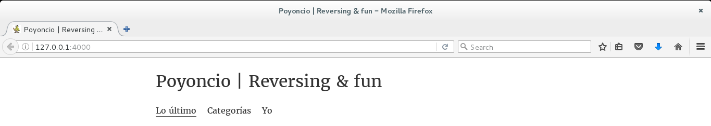

# POYOWEB 

Poyoweb es la página www.poyoncio.com lista para descargar y leer totalmente offline. 

### Requisitos 

Para instalar poyoweb con éxito es necesario tener las siguientes dependecias:
    
-> Ruby 2.2.3 o superiores
    
-> Ruby on rails 
    
-> Jekyll gem 

### Instalación

  **1.** [Instala ruby](https://www.ruby-lang.org/es/documentation/installation/)  
  
  
  **2.** [Instala ruby on rails](http://www.rubyonrails.org.es/instala.html)
  
  
  **3.** Instala la gema jekyll mediante la terminal:
      
      
      $gem install jekyll
      
  
  
  **4.** Descarga poyoweb:
       

  
  
  
  **5.** Entra en la carpeta "poyoweb" y instala las gemas necesarias:      
     
     
      $bundle install
     
  
  
  
  **6.** Ejecuta el servidor de jekyll y accede a  http://127.0.0.1:4000/: 
     
     
      $jekyll server
      
      
      
Y listo, ya lo tendrás instalado:

## Especiales gracias a [Alex Sun](https://github.com/syaning):

Muchas gracias por su gran trabajo con la [plantilla](https://github.com/syaning/vida).

## Licencia

Este proyecto esta bajo la licencia MIT - puedes vera en [LICENSE](LICENSE) para los detalles.

